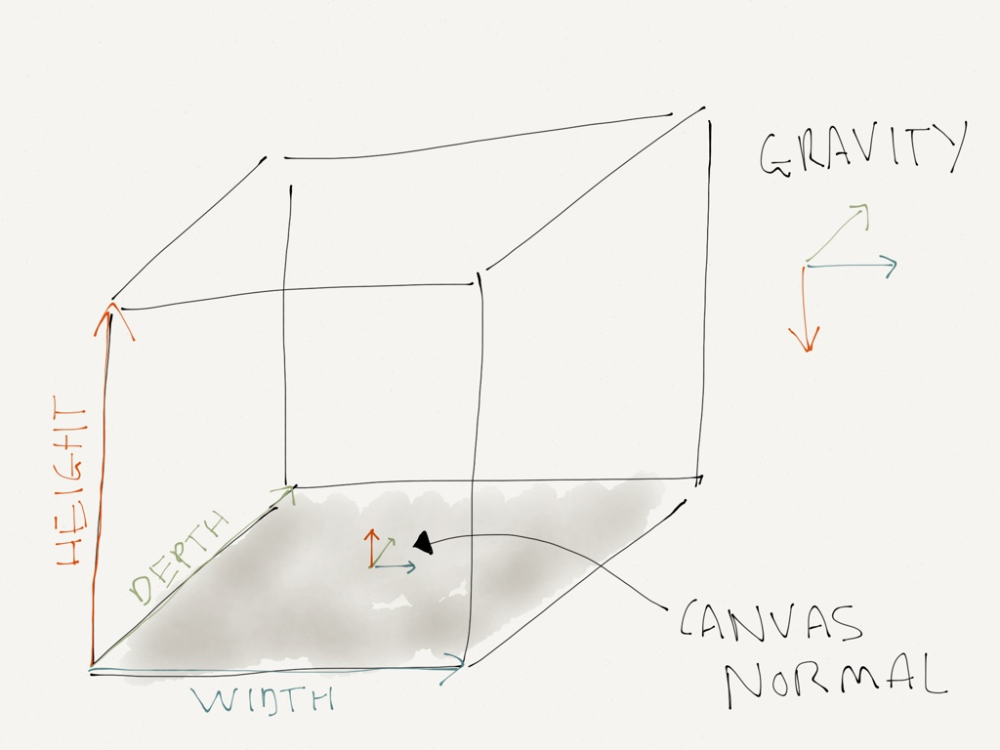

# Painting in Clojure

## Jackson Pollock


<div class="notes">
Famous 20th century abstract painter
</div>

## Defining our space - I



<div class="notes">
Some notes
</div>

## Defining our space - II

```{.clojure}
(def space [8   ;; width
            5   ;; height
            6]) ;; depth

(def gravity [0 -9.8 0])

(def canvas-normal [0 1 0])
```

## Picking a starting point

A gesture has to start somewhere inside of our defined space.

```{.clojure}
(defn starting-point [] (map rand space))
```

<div class="notes">
Some notes
</div>

## Projection

Drawing + code

<div class="notes">
Some notes
</div>

## Splatter

Drawing + code

<div class="notes">
Some notes
</div>

## Paths

Drawing + code

<div class="notes">
Some notes
</div>

## A sense of motion

Drawing + code

<div class="notes">
Some notes
</div>

## Pull it all together

<canvas id="pollock" style="width:80%"></canvas>
<br/>
<button id="add">Add a stroke</button>
<button id="fill">Fill canvas</button>

