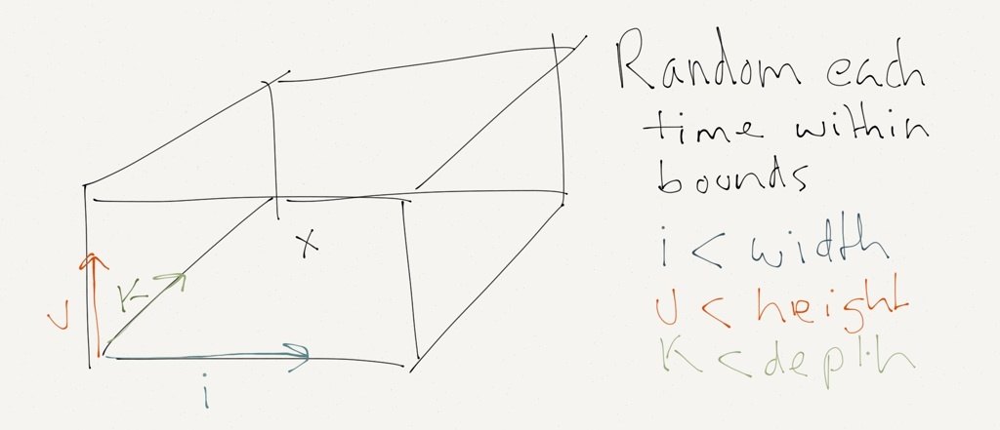
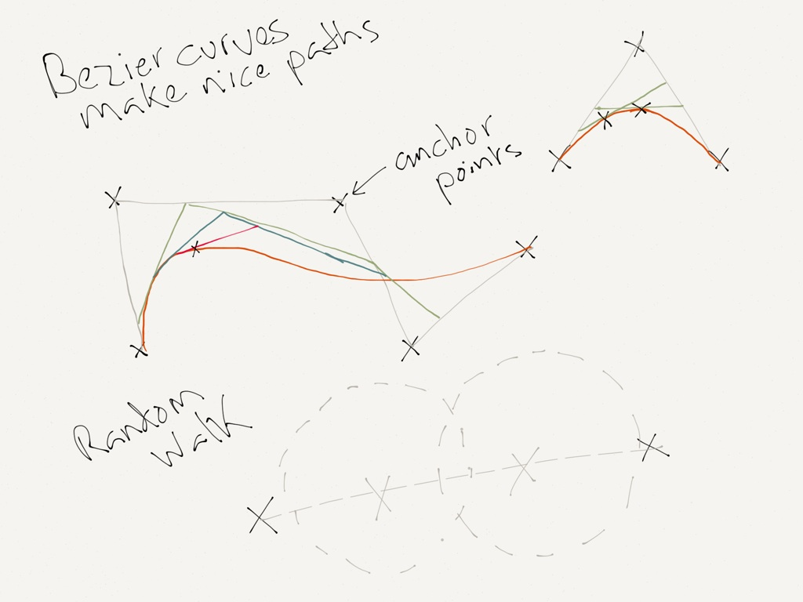
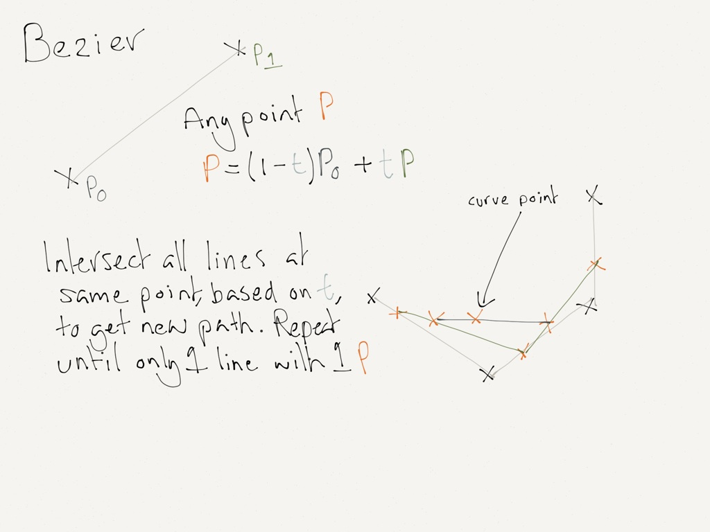
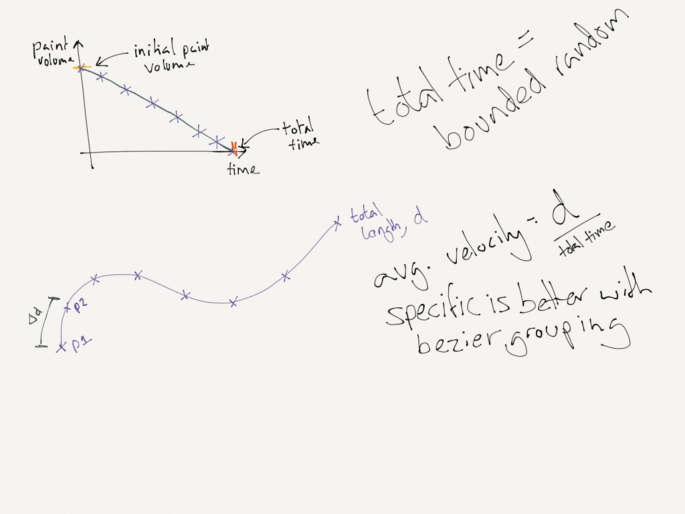

# Painting in Clojure

<div style="font-size:2em">by @tombooth</div>

<div class="notes">
   - Picked up as an early 'learn clojure' project
   - Not a web project
   - Not just programming, reminded me of some basic physics
</div>

# Jackson Pollock


<div class="notes">
   - Famous 20th century abstract painter
   - Made 'drip painting' famous, a form of action paiting
   - Drips paints off brushes, sticks or bits of wood onto the cavnas
   - We are going to start our model by considering a single point of paint, rather than a path
</div>

# Defining our space - I


<div class="notes">
   - We need a space to work in and some basic physical details
</div>

# Defining our space - II

```{.clojure}
(def space [8   ;; width
            5   ;; height
            6]) ;; depth

(def gravity [0 -9.8 0])

(def canvas-normal [0 1 0])
```

<div class="notes">
   - Facts defined using def and given a name
   - These are composed of basic clojure types
   - All our measurements are in SI units with pixel conversion in drawing
</div>

# Picking a starting point

A gesture has to start somewhere inside of our defined space.



```{.clojure}
(defn starting-point []
  (map rand space))
```

<div class="notes">
   - A gesture has to start somewhere
   - A very expressive set of characters
</div>

# Projection - I


<div class="notes">
   - Our point needs to hit the canvas
   - Using basic equations of motion
   - We know the the canvas is at y = 0
   - We need ot find time to impact in order to find other values
</div>

# Projection - II

```{.clojure}
(defn time-to-canvas [position velocity acceleration]
  (let [a acceleration
        b (* 2 velocity)
        c (* 2 position)
        discriminant (- (* b b) (* 4 a c))
        minus-b (- 0 b)
        add-sqrt (/ (+ minus-b (Math/sqrt discriminant)) (* 2 a))
        minus-sqrt (/ (- minus-b (Math/sqrt discriminant)) (* 2 a))]
    (max add-sqrt minus-sqrt)))
```

<div class="notes">
   - Solved nicely using Quadratic Equation
   - One value will be negative so always pick the max
</div>

# Projection - III

```{.clojure}
(defn position-at [time initial-position initial-velocity acceleration]
  (+ initial-position
     (* initial-velocity time)
     (/ (* acceleration time time) 2)))

(defn velocity-at [time initial-velocity acceleration]
  (+ (* acceleration time) initial-velocity))

(defn project-point [position velocity]
  (let [[i j k]            position
        [vi vj vk]         velocity
        [ai aj ak]         gravity
        time               (time-to-canvas j vj aj)
        projected-position [(position-at time i vi ai)
                            0
                            (position-at time k vk ak)]
        projected-velocity [(velocity-at time vi ai)
                            (velocity-at time vj aj)
                            (velocity-at time vk ak)]]
    [projected-position
     projected-velocity]))
```

<div class="notes">
   - Now we have time to impact it is easy to derive everything else
   - For the position we can use the same function as we derieved the time with:
      + $r = r0 + v0 * t + \frac{at^2}{2}$
   - For velocity we can use: $v = at + v0$

   - An important aspect of Pollock's paintings is the splatter made
     as he flicks paint against the canvas, we are now going to look
     at how to work out whether this impact should splatter
</div>

# Splatter - I


<div class="notes">
   - We need to work out whether an impact should splatter
      + look at the impact force
      + Impact force derived from work-energy principle:
         * W=\Delta E_k=\tfrac12mv_2^2-\tfrac12mv_1^2,
   - We need to define a cutoff for this
   - If it does splatter we need to bounce the vector
   - Collision is inelastic so it should absorb some of the vector
      + inelastic means conservation of energy is not maintained and energy is lost
        through various means
</div>

# Splatter - II

```{.clojure}
;; B = V - (2 * (V.N) * N)

(defn dot-product [vector1 vector2]
  (reduce + (map * vector1 vector2)))

(defn vector-subtraction [vector1 vector2]
  (map - vector1 vector2))

(defn vector-multiply-by-constant [vector constant]
  (map #(* % constant) vector))

(defn bounce-vector [vector normal]
  (let [vector-dot-normal (dot-product vector normal)
        extreme (vector-multiply-by-constant normal (* 2 vector-dot-normal))]
    (vector-subtraction vector extreme)))
```

<div class="notes">
The equation to bounce a vector, $V$, off a plane with normal, $N$, is:

   - $N$ is the normal vector of the plane
   - $V$ = the incoming vector
   - $B$ is the outgoing, bounced, vector

$B = V - (2 * (V.N) * N)$
</div>

# Paths - I



<div class="notes">
   - Parametric curves used in vector graphics because they scale indefinitely
   - Gives nice smooth curves
   - We need anchor, or control, points to calculate a bezier curve
   - Do a random walk in a random direction to define these
</div>

# Paths - II

```{.clojure}
(defn random-path [position step-vector bounds]
  (cons position
        (lazy-seq (random-path (vector-add (vector-add position step-vector)
                                           (random-vector-between (- 0 bounds) bounds))
                               step-vector bounds))))

(defn anchor-points [position min-distance max-distance min-steps max-steps variation]
  (let [direction        (random-unit-vector)
        distance         (random-between min-distance max-distance)
        steps            (random-between min-steps max-steps)
        step-vector      (vector-multiply-by-constant direction (/ distance steps))
        random-positions (take steps (random-path position step-vector variation))
        end-position     (vector-add position
                                     (vector-multiply-by-constant step-vector steps))]
    (conj (vec random-positions) end-position)))
```

<div class="notes">
   - Lazy seqs, they are aces
   - Random total distance and number of steps
   - These are then used to work out the anchor points
   - A known end point is used
</div>

# Paths - III



<div class="notes">
   - De casteljau is a recursive method for evaluating Bezier curves
   - Finding a point between two points (along a line)
   - De casteljau is just that on mainly lines in parallel
</div>

# Paths - IV

```{.clojure}
(defn recur-relation [t a b]
  (+ (* t b) (* a (- 1 t))))

(defn for-component [t component-vals]
  (if (= (count component-vals) 1)
    (first component-vals)
    (for-component t
      (map #(recur-relation t %1 %2) component-vals (rest component-vals)))))

(defn for-t [t components]
  (map #(for-component t %) components))

(defn de-casteljau [control-points step-amount]
  (let [x-vals (map first control-points)
        y-vals (map second control-points)
        z-vals (map #(nth % 2) control-points)
        points (map #(for-t % [x-vals y-vals z-vals]) (range 0 1 step-amount))]
    points))
```

<div class="notes">
   - Considers each dimension on its own
   - recur-relation is the weighted point calc
</div>

# A sense of motion - I



<div class="notes">
   - Linear model for paint volume and velocity
   - Sectors of path won't be even so need to consider velocity in sector
</div>

# A sense of motion - II

```{.clojure}
(defn velocity-between [point1 point2 total-time total-distance]
  (let [difference-vector (vector-subtraction point1 point2)
        time-between (* total-time (/ (distance-between-points point1 point2)
                                      total-distance))]
    (vector-divide-by-const difference-vector time-between)))

(defn path-velocities [path total-time]
  (let [total-distance   (path-length path)
        number-of-points (count path)]
    (conj (vec (map-2 #(velocity-between %1 %2
                                         total-time
                                         total-distance)
                      path))
          [0 0 0])))

(defn path-masses [path initial-mass]
  (let [number-of-points (count path)
        step (- 0 (/ initial-mass number-of-points))]
    (take number-of-points (range initial-mass 0 step))))
```

<div class="notes">
   - map-2 runs over pairs of numbers
</div>

# Pull it all together

<canvas id="pollock" style="width:80%"></canvas>
<br/>
<button id="add">Add a stroke</button>
<button id="fill">Fill canvas</button>

